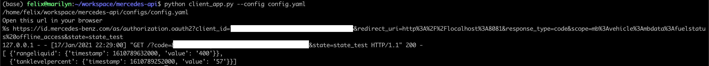

# Mercedes Developer API Client

Client library that retrieves data from the [Mercedes Developer API](https://developer.mercedes-benz.com/) for your own car (BYOD - Bring your own car)

## Installation

### Required packages

Python 3.7.3

```bash
pip install -r requirements.txt
```

## Usage

### Config
Create a config file according to the example config file *example.yaml*:

```yaml
---
## example credentials for mercedes developer api
scopes: ['mb:vehicle:mbdata:fuelstatus', 'offline_access']
# client_id and client_secret can be found in the 'CONSOLE' of the MB API
# https://developer.mercedes-benz.com/console
client_id: ''
client_secret: ''
# vehicle identification number (vin) of your own vehicle that is connected to your Mercedes me and Mercedes Developer API account
vin: W**********
# redirect address for oauth2 authorization workflow / needs to be correctly set in the MB DEv API Console
redirect_uri: 'http://localhost:8081'
```
### Run

```bash
python client_api.py

```

### Example



## Affiliation

    This project is a non-commercial hobby project and in no way officially affiliated with Daimler AG or Mercedes-Benz AG.

## License
[MIT](https://choosealicense.com/licenses/mit/)